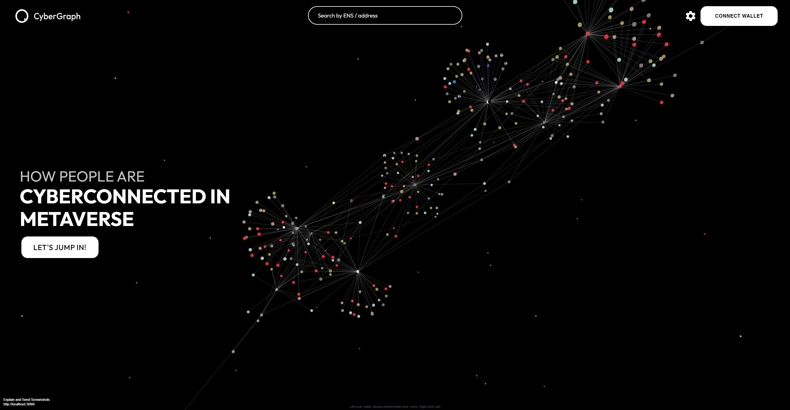

# CyberGraph


<!--  -->

## [`Live Site`](https://cyber-graph.vercel.app/)

## About this project

CyberGraph is a 3D-graph based, user based social connection explorer. It has some cool features like 3d node graph, dynamic loading bar, immersive user experience, cyber mode(10-hops friendship network display) and focus mode(aggregated connection display).

This project is inspired from Gitcoin [Scheduling Point Virtual Hackathon](https://gitcoin.co/issue/cyberconnecthq/explorer-and-cyberconnected-dapps/1/100027517) contest submissions which is making a social explorer with cyberconnect on Web3.

<br>

## Technologies We Used

-   [`Next.js`](https://nextjs.org/)
    <br>
-   [`TypeScript `](https://www.typescriptlang.org/)
    <br>
-   [`MUI library`](https://mui.com/)
    <br>
-   [`Cyber Connect`](https://docs.cyberconnect.me/)
    <br>
-   [`Apollo Client`](https://www.apollographql.com/docs/)
    <br>
-   [`3D Force-Directed Graph`](https://github.com/vasturiano/3d-force-graph)

<br>

## About Gitcoin Hackathon

CyberGraph is still well under improvement with many features in the pipeline. This is a perfect scenario for the whole community to join us and BUIDL together. Please see more information on Gitcoin [Grants Round 13 Hackathon CyberConnect Task 1](https://gitcoin.co/issue/cyberconnecthq/gitcoin-gr13-hackathon/1/)

<br>

We invite the community to experiment with it and add innovative features or make constructive product suggestions. A few examples that sprung to our mind: adding node visual effects to make it easier to read user info; differentiating connection & nodes visually, maybe on the basis of connection types, connection quantity, etc, and in terms of color, brightness, distance, etc; enabling continuous exploration where users can track their path of connections; adding subgroups; enabling exploring the connections between two queried nodes; optimizing graph filtering and visualization so to balance between UX and informative efficiency.

### Sub-tasks

-   POAP Fetching & NFT Fetching
-   Following & Follower List Display
-   Innovative Features & Product Suggestions (Like adding node visual effects features to make it easier to read user information)

Welcome to discuss and learn in our discord Hackathon channel and make your submission. CyberConnect team welcomes anyone who wants to join Web3 world and is happy to transfer development knowledge.

Participants from Gitcoin SPVH hackathon and other contributors please contact brucew@cybertinolab.com to append to the list. We are looking forward to more people's participation!

<br>

## Run the App

Set the following variables in `.env`

-   `NEXT_PUBLIC_MORALIS_SERVER_URL = `[`Moralis Server URL`](https://docs.moralis.io/moralis-dapp/connect-the-sdk/connect-with-reacts)
-   `NEXT_PUBLIC_MORALIS_APP_ID = `[`Moralis App ID`](https://docs.moralis.io/moralis-dapp/connect-the-sdk/connect-with-reacts)

Then run:

```
yarn install

yarn run dev
```

Open the browser, open [Localhost](https://localhost:3000/) and you will see the UI of the project.

<!-- ## ✨Contribution

CyberGraph is an open-source, community-driven project, with co-authors and contributors from CyberConnect dev team and community.

Lists are in **no particular order**. All co-authors & contributors work together and share the credits.

**Co-Authors**

| Co-Authors                                                                                                                      | Description                                                                                                                                                                                                                     |
| ------------------------------------------------------------------------------------------------------------------------------- | ------------------------------------------------------------------------------------------------------------------------------------------------------------------------------------------------------------------------------- |
| <a href="https://github.com/WildSaoFeng"></a> | WildSaoFeng: Initiated the project, set up tech framework, worked on MetaVerse building, the 3d-model generation, graph building, connection data fetching & processing, dynamic loading bar, two-mode proposer and implementer |
| <a href="https://github.com/BruceWangyq"></a>      | Bruce: Created page layout and UI components like User Panel, Navbar, Search Bar, Wallet Connect Button. Data fetching through different components. Researched and set up the 3d-Graph library.                                |
| <a href="https://www.behance.net/wanghanyang"></a>                    | Hanyang: A talent and pushy UI designer and PM, who designed the product and insisted on using 3D display, so we can have this current version of product                                                                       |
| <a href="https://github.com/jiayi1992"></a>         | Jiayi: Fix issues and give detailed and patient instructions to other co-authors                                                                                                                                                |

**Contributors**

| Contributors                                                                                                                                                                             | Description                                                         |
| ---------------------------------------------------------------------------------------------------------------------------------------------------------------------------------------- | ------------------------------------------------------------------- |
| <a href="https://github.com/sThReal"></a>                                                                      | HappySean: Providing frontend tech support                          |
| <a href="https://github.com/akasuv"></a>                                                                      | SUV: Providing frontend tech support                                |
| <a href="https://github.com/Neo697"></a>                                                                      | Yaoxuan: Providing frontend tech support                            |
| <a href="https://github.com/gio-XD"></a>                                                                      | Gio: Providing frontend tech support                                |
|  | Wilson: Providing guide & product feedback                          |
| <a href="https://github.com/ryanli-me"></a>                                                                    | Ryan: Providing guide & product feedback                            |
| <a href="https://github.com/spadequeen7"></a>                                                                  | SpadeQueen7: Providing guide & product feedback                     |
| <a href="https://github.com/ZhimaoL"></a>                                                                     | Zhimao: Providing guide & product feedback                          |
| <a href="https://github.com/yilan-huang"></a>                                                                 | Yilan: Providing professional proofreading help                     |
| <a href="https://www.linkedin.com/in/wzhu81"> </a>                                                                | Wenyi: Providing professional proofreading help                     |
| <a href="https://github.com/HaoPeiwen"></a>                                                       | Peiwen: Providing indexer tech support                              |
| <a href="https://github.com/cc-fruit"></a>                                                                    | CC_Fruit: Providing indexer tech support                            |
| <a href="https://github.com/cyberconnecthq"></a>                                                        | All CyberConnect Teams & Community: providing all kinds of supports | -->

## Follow Us

-   [Twitter](https://twitter.com/CyberConnectHQ)
-   [Discord](https://discord.com/invite/bYJ3cB7bbC)
-   [Website](https://cyberconnect.me/)
